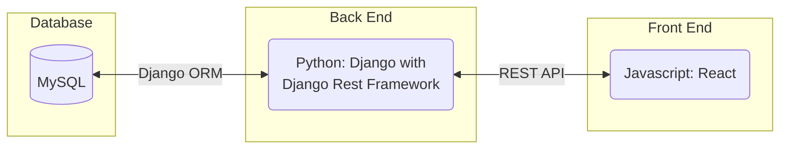
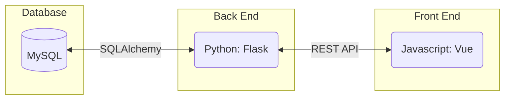
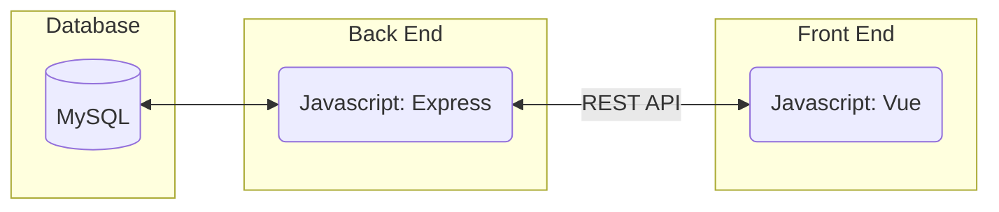
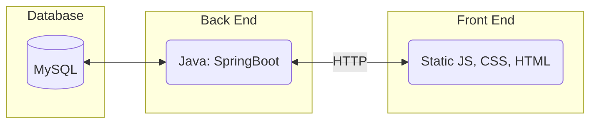
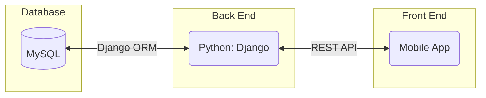
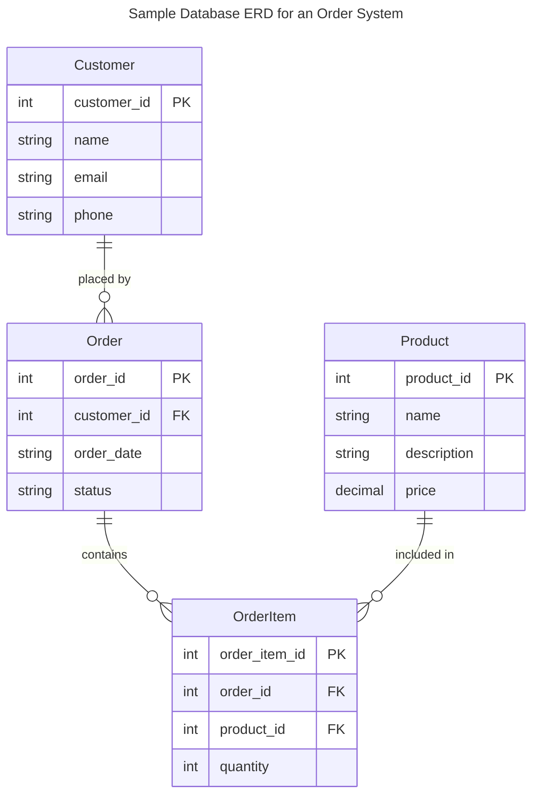
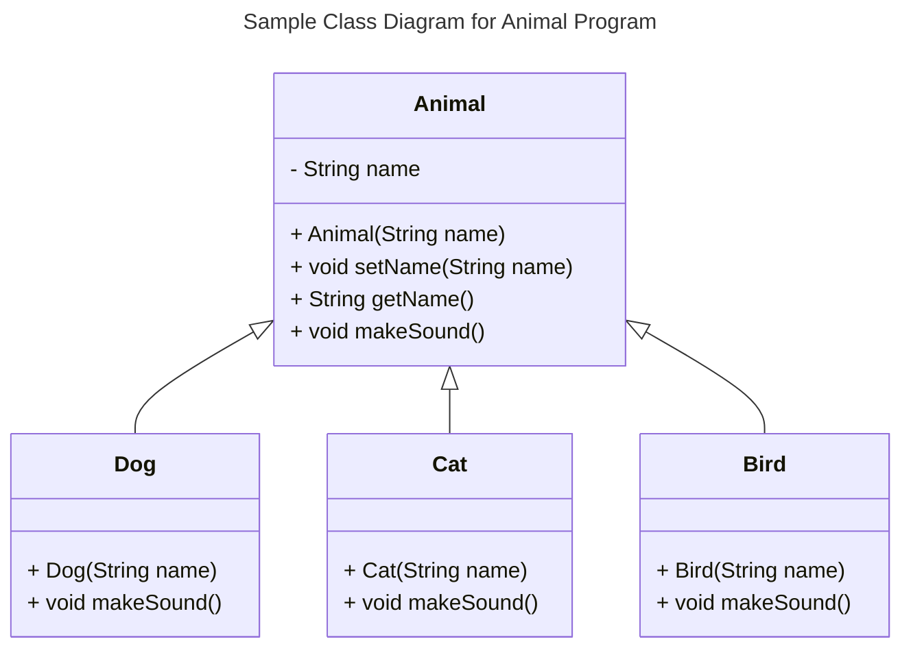
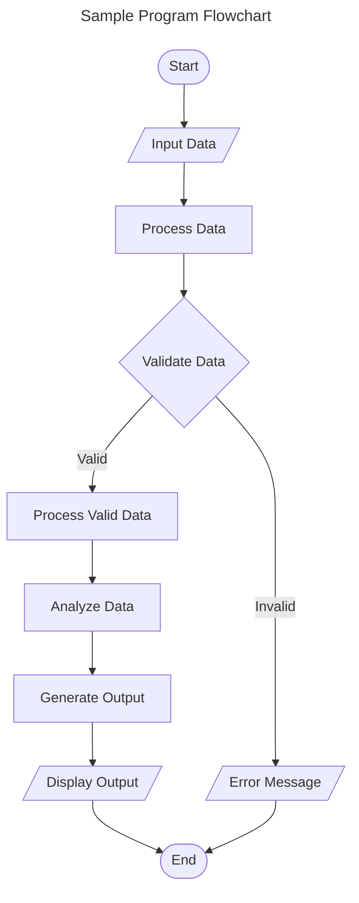
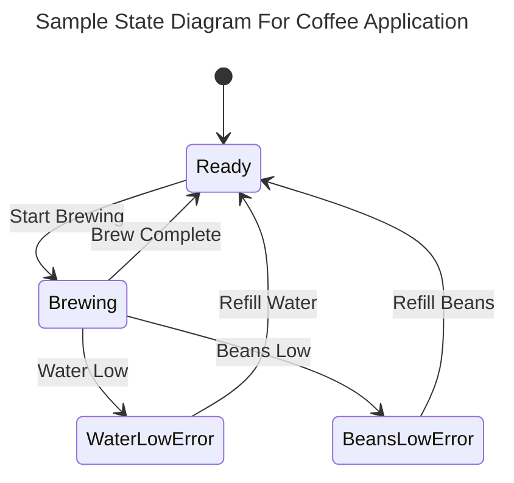
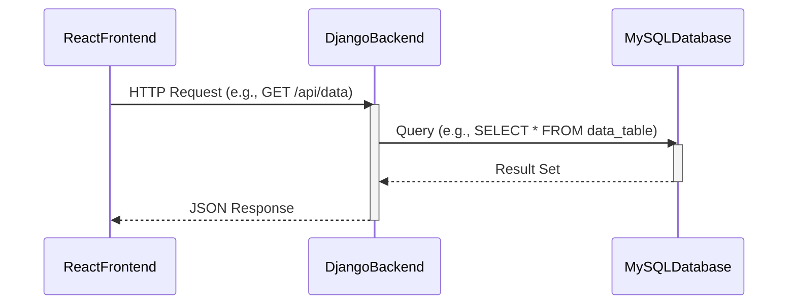

# Project README

This document serves as the initial README for the project. It will be updated as the team finalizes project specifications and implementation details.

## TeamName

<!--The name of your team.-->
T_06

### Project Abstract

<!--A one paragraph summary of what the software will do.-->
---------------
This project is a web-based application that allows users to create, manage, and solve crossword puzzles. Users can manually design puzzle layouts, add words and clues, and save puzzles to their accounts. Future enhancements may include automatic puzzle generation and validation.

### Customer

---------

<!--A brief description of the customer for this software, both in general (the population who might eventually use such a system) and specifically for this document (the customer(s) who informed this document). Every project will have a customer from the CS506 instructional staff. Requirements should not be derived simply from discussion among team members. Ideally your customer should not only talk to you about requirements but also be excited later in the semester to use the system.-->

The primary customers for this software are individuals who enjoy creating and solving crossword puzzles. This includes puzzle enthusiasts, educators looking to create custom puzzles for students, and casual users who want to generate fun challenges for friends and family.

Additionally, the project is designed with a broader audience in mind, including those who may use crossword puzzles for language learning or cognitive exercises. The initial customer group providing input will be the instructional staff for this project. Their feedback will help guide feature development and ensure usability.

### Specification
---
<!--A detailed specification of the system. UML, or other diagrams, such as finite automata, or other appropriate specification formalisms, are encouraged over natural language.-->
#### Core Features:

- Puzzle Creation: Users can manually specify puzzle layouts, add words, and write clues.
- Puzzle Saving & Retrieval: Users can save their created puzzles to an account and access them later.
- User Accounts: Users can sign up/log in to save puzzles and track progress.
- Puzzle Solving: Users can play and complete their own puzzles.

#### Advanced Features (if time permits):

- Automated Puzzle Generation: Given a list of words, the system will attempt to generate a valid crossword layout.
- Puzzle Validation: A helper function will check if a manually created puzzle is solvable.
- Community Sharing: Users may browse, share, and solve puzzles created by others.
- Customization Options: Themes, fonts, and color schemes for personalized experiences.

#### System Requirements:

- A responsive web application accessible via modern browsers.
- Backend support for storing user-created puzzles and user accounts.
- A scalable database for managing word-clue pairs for automatic generation features.
- Secure authentication for user data protection (if account-based features are implemented).

#### Technology Stack

---

Here are some sample technology stacks that you can use for inspiration:

#### Database

#### Class Diagram

#### Flowchart

#### Behavior

#### Sequence Diagram

### Contribution Guidelines
---
<!--How team members should contribute (branching strategy, pull requests, issue tracking).-->
- Use feature branches for development.
- Follow code style guidelines.
- Submit pull requests for review before merging.

### Standards & Conventions
---

<!--This is a link to a seperate coding conventions document / style guide-->
[Style Guide & Conventions](STYLE.md)

### Prototype
---

Visit the project's [Figma](https://www.figma.com/design/x1LcIQ4UPfRiuHEANglx8u/T06-Puzzle-game?node-id=0-1&t=LpHs09RGdHmT840l-1). Welcome to view and edit.
